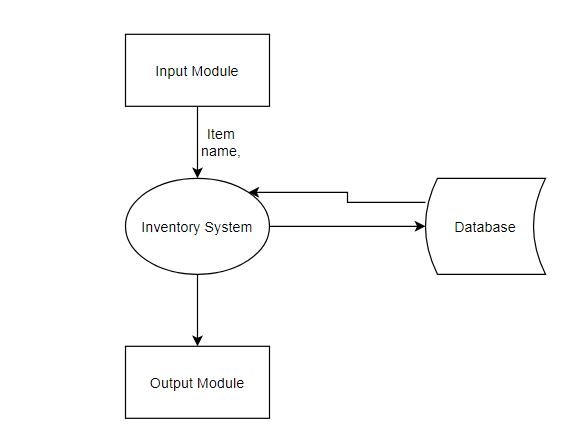
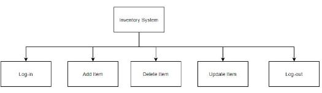
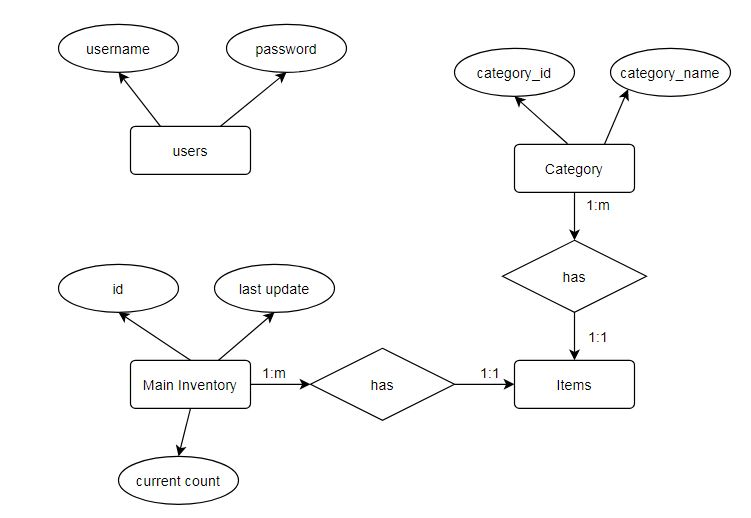
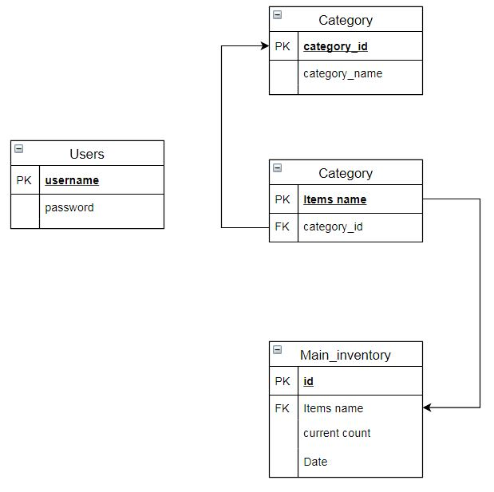
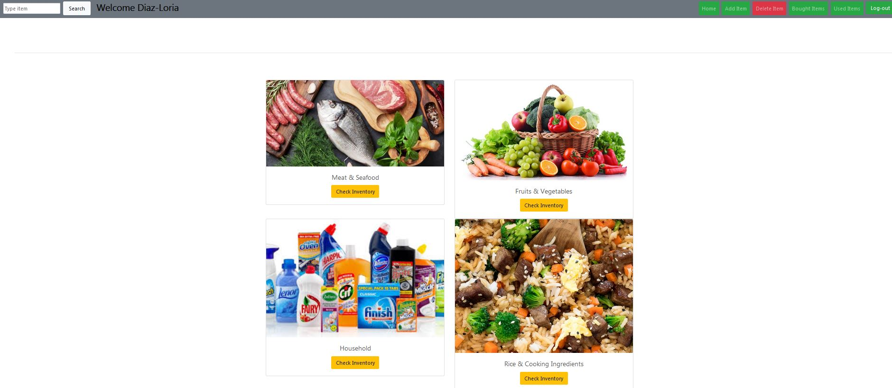
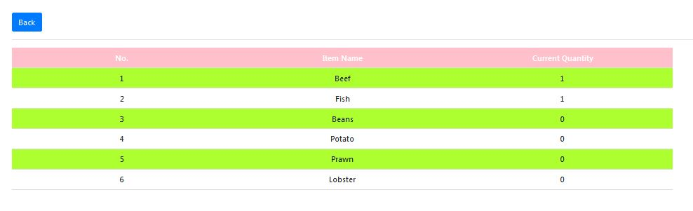
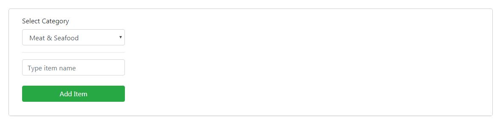
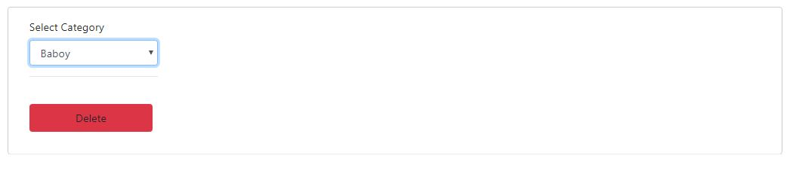
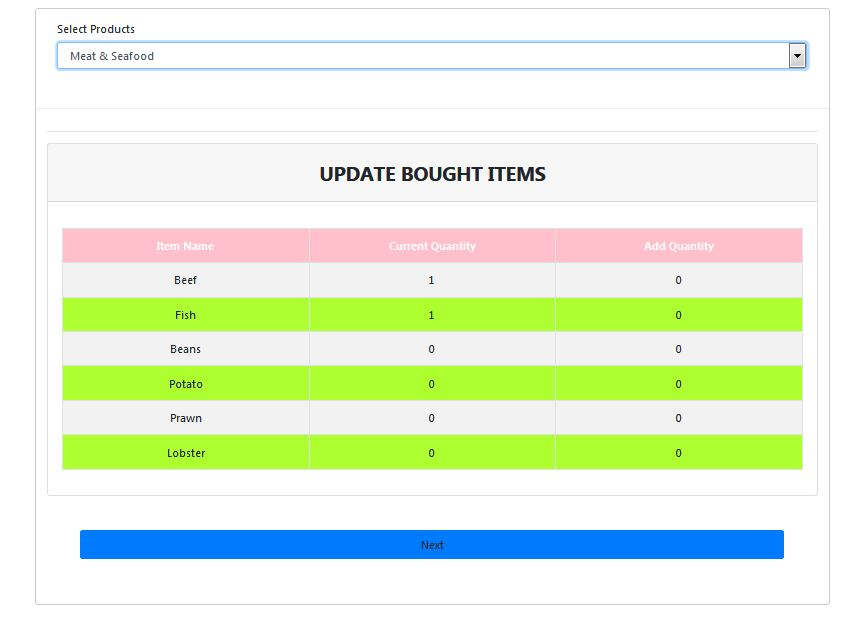

# HH-Inventory
## Background
This dynamic website is used to track all our stocks - Meat & Seafood, Fruits & Vegetables,and Household among others - in the house.
 I realized that some of our food got spoiled and sometimes we keep on buying the things we already have on our shelves.So, I decided to create this website to solve this issue.
 
 ## Programming Languages
 This website is developed using HTML, CSS,Javascript, PHP, and MySQL languages.
                            The styling is mostly written using Bootstrap.
                            Since the website requires a database, I used MySql as the DBMS and PHP to fetch the data from
                            the database.
                            The website is hosted by Hostinger.
                            
## Database Design

 
 
 
  
       
## Sample Screenshoots

*In the home page, list of category is displayed.*

  
  
  
*Click the Check Inventory button to see the items under that category.*

  

*Add and delete items*

  
  
  
*Update the items bought*

  
